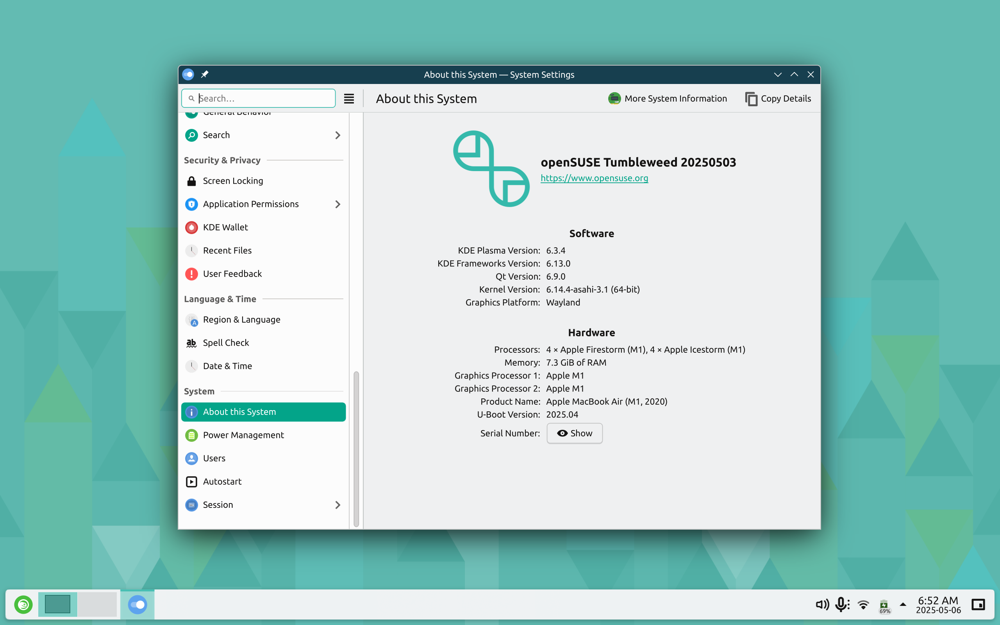

# asahi-opensuse

This repository contains kiwi configs and rpmbuild spec files in order to install openSUSE Tumbleweed to an Apple Silicon machine. I don't plan on releasing images for installation of others as these require commitment and dedication. This repository **primarily serves as backup for me** but hopefully it will be useful for others.

If you intend to use these to install a daily driver system, I **HIGHLY RECOMMEND** to just use the official Fedora Asahi Remix release or any of the distributions in this list: . It will save yourself from issues and headaches as the files here need more polishing and rigourous testing.

_**Please use at your own risk**_.

## Current State

I am currently running openSUSE Tumbleweed on an Apple Macbook Air M1 (2020) as of May 2025.

## HOWTO

The initial creation of the packages and installation image was done in openSUSE Tumbleweed running in macOS via UTM. All updates to the packages were performed in the actual openSUSE Tumbleweed installation via local OBS.

In a nutshell, the flow of the building process is:
- Generate packages using the provided spec files (refer to [OBS project](https://build.opensuse.org/project/show/home:mrkcee)) or use built packages from OBS (USE AT YOUR OWN RISK)
- Create local repository (createrepo)
- Configure installation image by editing kiwi config files
- Generate raw image using kiwi-ng script
- Generate the installer images using the make-installer script
- Host the generated tar archive using a local http server
- Create installer using asahi-installer (or just use/patch the official one)
- Run the installer

Good luck :D

## Big thanks to the following:
- ivabus - for the initial configs
- Fedora Asahi SIG Team - basis of some specs
- tpwrules / NixOS on Apple Silicon - basis of some specs
- openSUSE maintainers - basis of some specs
- openSUSE project - for openSUSE Tumblweed, KIWI, Snapper, and Open Build Service
- SUSE and others - for sponsoring openSUSE
- Asahi Linux team and contributors - for creating Asahi Linux and other modules
- Folks who have provided their feedback and constructive comments

